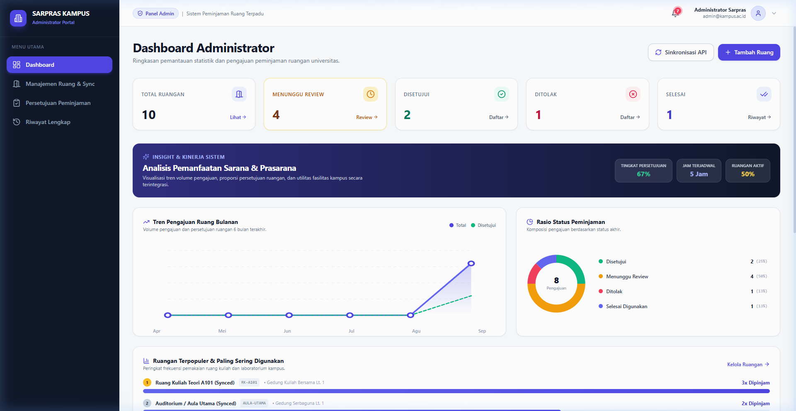
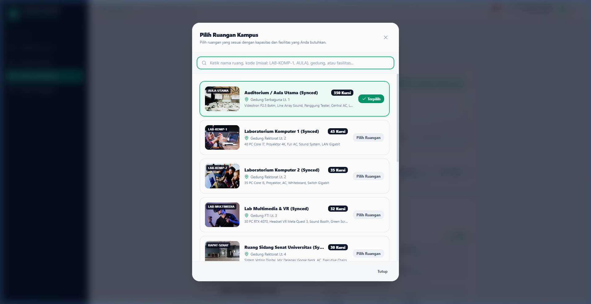
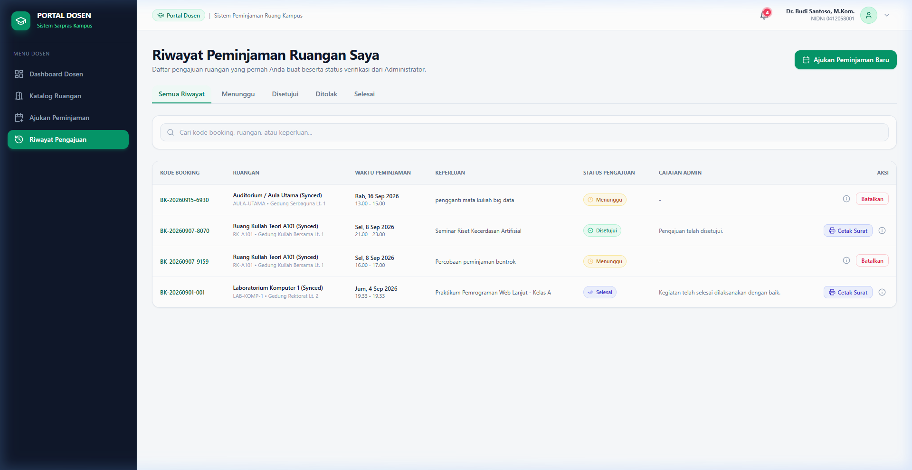
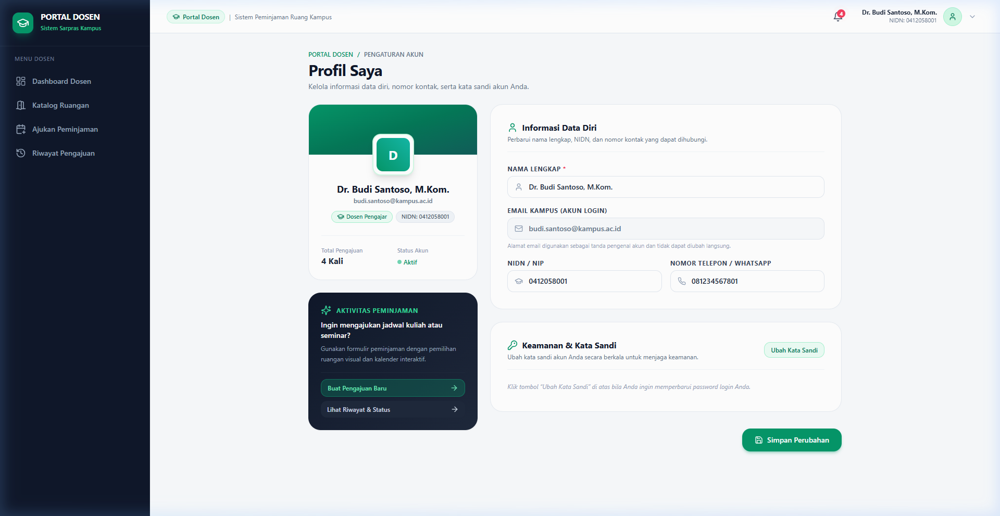

<div align="center">

# 🏛️ Sistem Peminjaman Ruang Universitas
### Enterprise Campus Facilities & Room Reservation Management Platform

[](https://github.com/satrianugrahasaputra/sistem_peminjaman_ruangan_universitas/actions)


<p align="center">
  Platform web full-stack terintegrasi untuk reservasi dan manajemen sarana prasarana perguruan tinggi (ruang kuliah, laboratorium komputer, aula, dan ruang seminar) berbasis pencegahan bentrok jadwal otomatis, persetujuan bertingkat, verifikasi surat izin QR Code, visualisasi analitik interaktif, serta notifikasi in-app terpadu.
</p>

</div>

---

## 📸 Media Visual & Tangkapan Layar Aplikasi

Berikut adalah dokumentasi antarmuka pengguna (*User Interface*) utama yang dirancang dengan estetika modern, responsif, dan standar *human-centered design*:

### 1. 📊 Dashboard Admin & Visualisasi Analitik Interaktif
> Dilengkapi metrik KPI real-time, grafik tren peminjaman bulanan (*Area Chart*), diagram proporsi status (*Donut Chart*), peringkat ruangan terpopuler, dan lonceng notifikasi real-time.



---

### 2. 🏢 Modal Pemilihan Ruangan Visual & Interaktif
> Pengalaman pemesanan ruangan yang intuitif dengan katalog berfoto, badge kapasitas, filter gedung, dan deteksi ketersediaan instan.



---

### 3. 📅 Riwayat & Pemantauan Jadwal Peminjaman
> Tabel pantauan komprehensif dengan status siklus 4 tahap (*Menunggu*, *Disetujui*, *Ditolak*, *Selesai*), filter status multi-kategori, pencarian cepat, dan akses cetak surat izin resmi ber-QR Code.



---

### 4. 👤 Halaman Profil Pengguna & Keamanan Akun
> Fitur personalisasi data dosen/admin, pembaharuan NIDN dan nomor telepon, ubah kata sandi dengan enkripsi bcrypt aman, serta navigasi pintas.



---

## 🌟 Fitur-Fitur Utama Sistem

| Fitur Unggulan | Deskripsi Implementasi & Keunggulan |
|---|---|
| **🔔 In-App Notification (Lonceng Notifikasi)** | Ikon lonceng interaktif di navbar dengan indikator unread badge dan popover dropdown real-time. Dosen menerima update persetujuan/penolakan instan, dan Admin menerima notifikasi pengajuan baru yang siap ditinjau. Dilengkapi fitur *Mark all as read*. |
| **🛡️ Deteksi & Pencegahan Bentrok Jadwal (Zero-Conflict)** | Formula matematis ketat $(\text{Start}_A < \text{End}_B \land \text{End}_A > \text{Start}_B)$ berjalan secara real-time pada formulir pengajuan dan saat proses persetujuan oleh Admin. Menjamin tidak ada dua jadwal kuliah yang tumpang tindih. |
| **📄 Cetak Surat Izin Resmi (PDF & QR Code)** | Penerbitan lembar rekomendasi/surat izin peminjaman resmi standar universitas lengkap dengan kop surat institusi, rincian jadwal, stempel digital, dan verifikasi QR Code terenkripsi. |
| **📈 Dashboard Statistik & Visualisasi Analitik** | Visualisasi tren peminjaman bulanan dengan tooltip interaktif, status breakdown chart, dan perankingan ruangan paling sering digunakan untuk pengambilan keputusan pihak Sarpras. |
| **🔄 Sinkronisasi API Eksternal (Fault-Tolerant)** | Sinkronisasi data katalog ruangan terpadu dari WebService eksternal (`/api/rooms/sync`) dengan mekanisme *graceful fallback* saat endpoint eksternal mengalami kendala. |
| **🔐 Role-Based Access Control (RBAC)** | Proteksi route berlapis melalui Next.js `middleware.ts`. Portal Admin (`/admin/*`) dan Portal Dosen (`/dosen/*`) terisolasi penuh dengan session cookie berbasis JSON Web Token (JWT) yang aman. |
| **🗃️ Audit Trail & Retensi Data Permanen** | Pembatalan peminjaman menerapkan mekanisme *soft-delete* (`isDeleted = true` dan `deletedAt`) sehingga riwayat audit historis tetap terjaga untuk akreditasi kampus. |

---

## 🛠️ Arsitektur & Teknologi

- **Frontend & App Router**: Next.js 14+ (React Server & Client Components)
- **Language**: TypeScript (Type-Safe End-to-End)
- **Styling**: Tailwind CSS & Lucide React Icons
- **Database & ORM**: SQLite (Prisma ORM) — portabel, *zero-configuration*, dan siap migrasi ke PostgreSQL/Supabase
- **Security & Hashing**: bcryptjs, Jose (JWT), Next.js Middleware HttpOnly Cookies
- **Automated Testing**: Vitest (Unit & Integration Business Logic Tests)
- **CI/CD Pipeline**: GitHub Actions (`.github/workflows/ci.yml`)

---

## 🧪 Pengujian Otomatis (Automated Testing CI/CD)

Proyek ini dilengkapi **23 automated test cases** yang menguji seluruh lapisan logika bisnis, integritas data, dan aturan validasi tanpa cacat:

```bash
npm run test
```

### Hasil Eksekusi Test Suite (100% PASS):
```bash
 ✓ src/__tests__/notifications.test.ts   (5 tests)
 ✓ src/__tests__/analytics.test.ts       (3 tests)
 ✓ src/__tests__/surat-izin.test.ts      (3 tests)
 ✓ src/__tests__/booking-system.test.ts  (8 tests)
 ✓ src/__tests__/profile.test.ts         (4 tests)

 Test Files  5 passed (5)
      Tests  23 passed (23) - 100% SUCCESS
```

Setiap kali kode di-push ke repository GitHub, workflow `.github/workflows/ci.yml` akan secara otomatis menguji build dan seluruh unit tests untuk menjamin keandalan sistem (*reliability*).

---

## 🚀 Panduan Menjalankan Proyek (Quick Start)

### 1. Prasyarat Sistem
- **Node.js**: Versi 18.x atau 20.x+ (disarankan Node 20 LTS)
- **NPM**: Versi 9.x atau 10.x+

### 2. Langkah Instalasi & Menjalankan

```bash
# 1. Masuk ke direktori proyek
cd "Sistem Peminjaman Ruang Universitas"

# 2. Instal seluruh dependensi
npm install

# 3. Sinkronisasikan skema Prisma ke database SQLite
npx prisma db push

# 4. Jalankan seeder database (10 Akun User & 10 Ruangan Fasilitas)
npm run db:seed

# 5. Jalankan automated test suite
npm run test

# 6. Jalankan local development server
npm run dev
```

Buka peramban di [http://localhost:3000](http://localhost:3000) untuk mengakses aplikasi.

---

## 🔑 Kredensial Akun Pengujian (Demo)

Tersedia tombol **"Quick Fill"** pada halaman Login untuk kemudahan demo pengujian instan:

| Role | Akun Email | Password | Hak Akses Utama |
|---|---|---|---|
| **Admin Sarpras** | `admin@kampus.ac.id` | `Admin123!` | Dashboard Analitik, Manajemen Ruang, Approval/Reject, Laporan CSV, Notifikasi Masuk. |
| **Admin Fasilitas** | `admin.sarpras@kampus.ac.id` | `Admin123!` | Verifikasi peminjaman, sinkronisasi ruangan, dan manajemen jadwal kampus. |
| **Dosen (Dr. Budi)** | `budi.santoso@kampus.ac.id` | `Dosen123!` | Formulir reservasi interaktif, cek bentrok real-time, riwayat, dan unduh lembar cetak PDF. |
| **Dosen (Dr. Siti)** | `siti.aminah@kampus.ac.id` | `Dosen123!` | Pengajuan peminjaman laboratorium komputer dan aula seminar. |

---

## 📡 Dokumentasi Endpoint API

| Metode | Endpoint | Deskripsi | Otorisasi |
|---|---|---|---|
| `POST` | `/api/auth/login` | Autentikasi user & penerbitan session cookie | Publik |
| `POST`/`GET` | `/api/auth/logout` | Menghapus session cookie & redirect | User Aktif |
| `GET` | `/api/auth/me` | Membaca data profil user yang sedang login | User Aktif |
| `GET` | `/api/notifications` | Mengambil feed notifikasi real-time (role-aware) | User Aktif |
| `GET` | `/api/dashboard/stats` | Mengambil data metrik statistik & analytics grafik | User Aktif |
| `GET` | `/api/rooms` | Daftar katalog ruangan & filter fasilitas | Publik / User |
| `POST` | `/api/rooms` | Menambah data ruangan baru | Admin Only |
| `PUT` | `/api/rooms/[id]` | Memperbarui data ruangan | Admin Only |
| `DELETE`| `/api/rooms/[id]` | Menghapus data ruangan | Admin Only |
| `POST` | `/api/rooms/sync` | Sinkronisasi katalog dari WebService eksternal | Admin Only |
| `POST` | `/api/bookings/check-conflict` | Validasi bentrok jadwal ruangan secara real-time | Dosen / Admin |
| `GET` | `/api/bookings` | Daftar riwayat dan pengajuan peminjaman | Dosen / Admin |
| `POST` | `/api/bookings` | Mengajukan peminjaman ruangan baru | Dosen Only |
| `PATCH`| `/api/bookings/[id]` | Menyetujui (*Approve*) atau Menolak (*Reject*) peminjaman | Admin Only |
| `DELETE`| `/api/bookings/[id]` | Membatalkan peminjaman (*Soft-Delete*) | Dosen / Admin |

---

## 👨‍💻 Kontribusi & Pengembang

Dikembangkan dengan dedikasi tinggi untuk memberikan solusi digitalisasi sarana prasarana perguruan tinggi yang efisien, transparan, dan berstandar rekayasa perangkat lunak modern.
